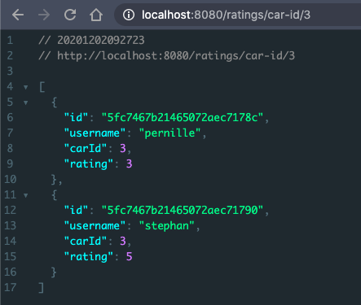
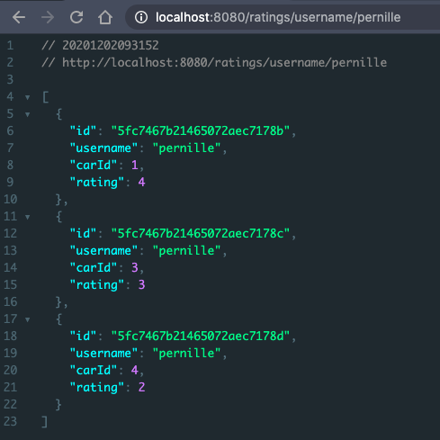
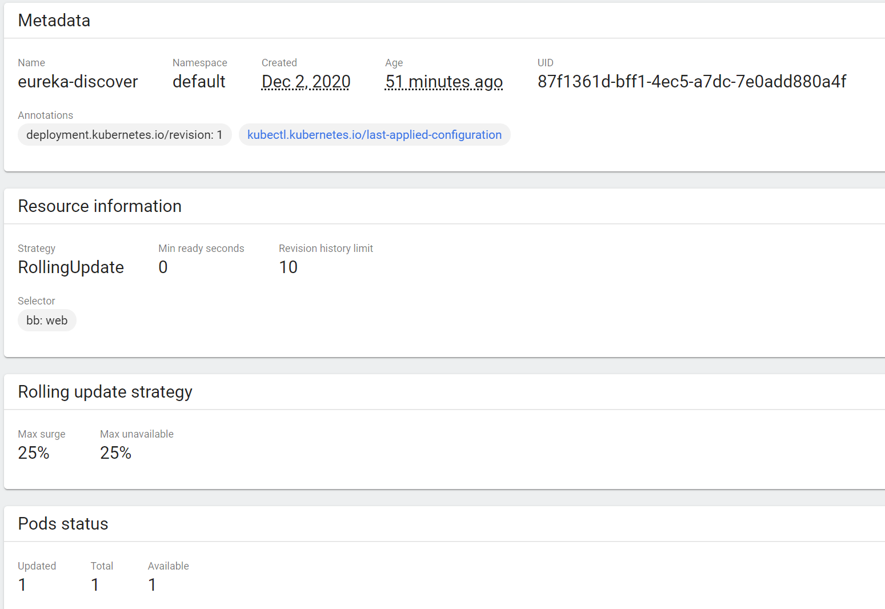

# Mini Project 4 | Microservices
_System Integration, Fall 2020_

**Adam Lass**  
**Pernille Lørup**  
**Rasmus Helsgaun**  
**Stephan Duelund Djurhuus**

## Objectives
### Task 1
Extend the rent-a-car application by adding a new service - user rating of cars. Create and use a MongoDB database as a storage of users. Enable the clients of the application to see:
- [x] the ratings of a particular car
- [x] the ratings they selves have given earlier

### Task 2
 - [ ] Deploy your microservices application in Kubernetes and explore its behavior.

## The Service
### Execution
Follow the steps below to start the services:

1. Start your local Mongo Database and Populate with the script below.

```javascript
db.user.insertMany([
    {username: "adam", cars: [1, 2, 5]},
    {username: "pernille", cars: [1,3,4]},
    {username: "rasmus", cars: [4, 5]},
    {username: "stephan", cars: [3]},
])

db.rating.insertMany([
    {username: "adam", carId: 1, rating: 1},
    {username: "adam", carId: 2, rating: 3},
    {username: "adam", carId: 5, rating: 5},
    {username: "pernille", carId: 1, rating: 4},
    {username: "pernille", carId: 3, rating: 3},
    {username: "pernille", carId: 4, rating: 2},
    {username: "rasmus", carId: 4, rating: 1},
    {username: "rasmus", carId: 5, rating: 2},
    {username: "stephan", carId: 3, rating: 5},
])
```

2. [Run the `Eureka` service](services/Eureka).
3. [Run the `Car Catalog` service](services/CarCatalog).

**Remember to create a H2 database in `CarCatalog` and name it `car`.**

> If the `/mycars` doesn't return anything, it's because the database isn't populated correctly. Fix this by running the sql files from resources in `CarCatalog` manually.

4. [Run the `Car Rating` service](services/CarRating).
5. [Run the `Car Gateway` service](services/CarGateway).

> Remember to close your `mongo` service after using the system.

### Usage

The Service uses the `Car Gateway` service to expose two endpoints for car ratings.
#### Get Car Ratings

```bash
http://localhost:8080/ratings/car-id/{carId}
```

Valid `carId`:
* `1` - Ferrari
* `2` - Lamborghini
* `3` - Bugatti
* `4` - Renault
* `5` - Mini

<p align="center">
    
</p>

#### Get own Ratings

```bash
http://localhost:8080/ratings/username/{username}
```

Valid `usernames`:
* `adam`
* `pernille`
* `rasmus`
* `stephan`

<p align="center">
    
</p>

## Deployment on Docker & Kubernetes
The euruka server has been pushed to docker hub with port 8761 and deployed on kubernetes port 30005.
Whenever the other services were deployed, the eureka server could not detect the other services.. However when they're run locally, the deployed eureka server can gain access to them.
We believe there's a solution to the connection, but have not yet solved it. The theory right now is, that they have to be connected on the same "overlay" network.

The deployment file for the eureka server on Kubernetes can be found here: 
[deployment.yaml](clusters/deployment.yaml)



##
Software Development @ Copenhagen Business Academy, Denmark 2020
